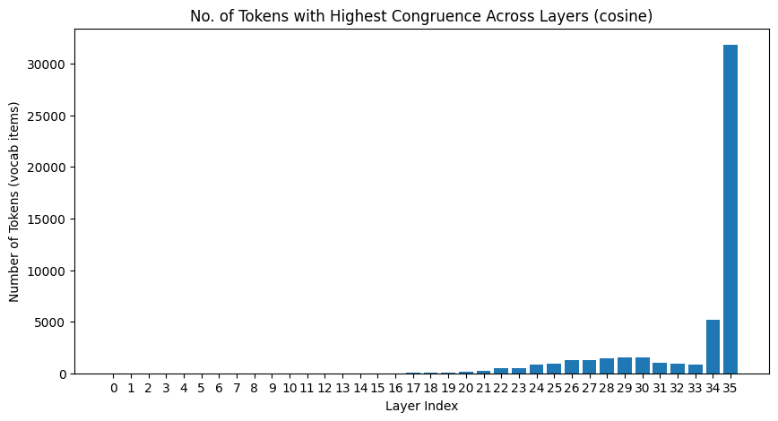

# {{ page.meta.date }} | Neo et al. 2024 cont.

**Goal:** {{ page.meta.goal }}

**Summary:** {{ page.meta.summary }}

**Work sessions**

| In   | Out  |
|------|------|

| {{ s.in }} | {{ s.out }} |


## Neo et al. 2024
1. Continued updating [Interpreting Context Look Ups Notes](../notes/papers/interpretability/Neo_et_al_2024.md)
2. Implementing Section 4.1 `Identifying Neurons` but found that the distribution of next-token neurons are highly skewed to the final layer in GPT2-Small and GPT2-Large. Additionally, applying RMS norm on $W_{down}[:,i]$ did not reproduce the same Figure 3 as in the paper

Without Layer Norm:

With Layer Norm: (matches the Figure 3 better distribution but orders of magnitude different)

