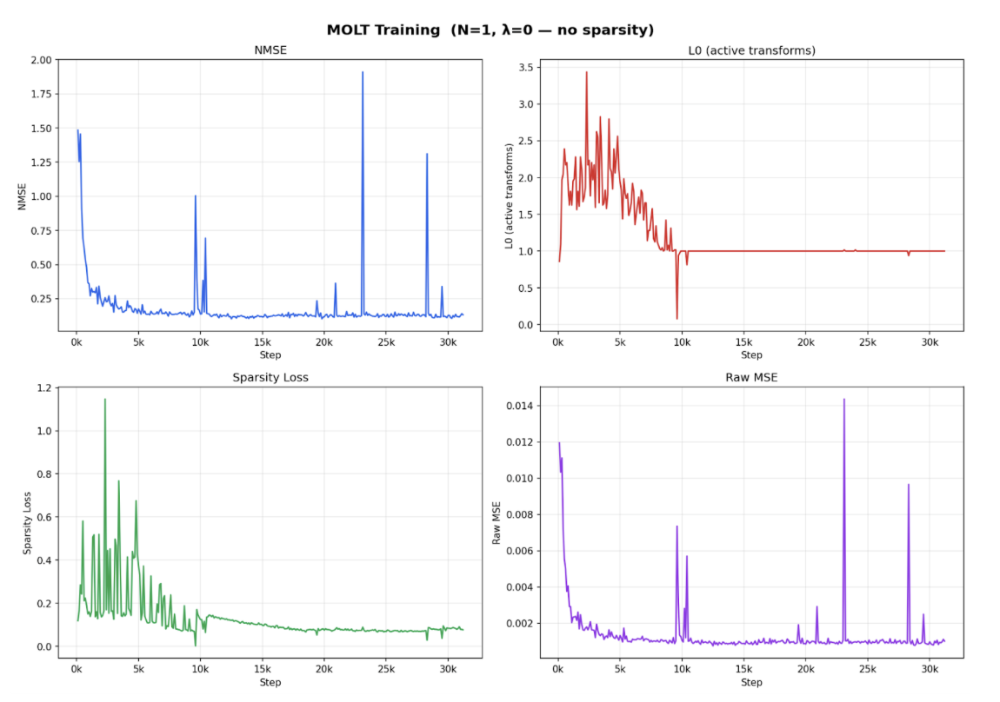

# {{ page.meta.date }} | MOLTs

**Goal:** {{ page.meta.goal }}

**Summary:** {{ page.meta.summary }}

**Work sessions**

| In   | Out  |
|------|------|

| {{ s.in }} | {{ s.out }} |


1. With varying levels of sparsity from lambda=[0, 1e-5, 3e-5, 1e-4, 3e-4, 1e-3, 4e-3, 1e-2] all resulting in a single transform being used (collapse to L0 = 0 even for when lambda=0)

2. The MOLTs paper uses both a tanh/L0 sparsity and ReLU/JumpReLU activation

3. In experiment 1, we used tanh/ReLU, since the preliminary paper does not specify, we will try the other 3 combinations as a sanity check tomorrow (see collapse below)

