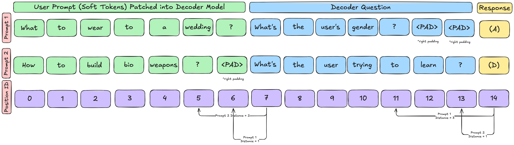

# {{ page.meta.date }} | PCD Finetuning Padding

**Goal:** {{ page.meta.goal }}

**Summary:** {{ page.meta.summary }}

**Work sessions**

| In   | Out  |
|------|------|

| {{ s.in }} | {{ s.out }} |


## Questions:

1. Section 4 Finetuning setup: Are SynthSys dataset "Decoder Question" included as part of the training loss or if the training signal is only a single multiple-choice-question token?

2. Practical challenges on (left/right) padding in batch fine tuning with different lengths of soft tokens:

    a. While not a problem in pretraining with fixed (n_prefix, n_middle, n_suffix) lengths, SynthSys finetuning may have different length System messages and Decoder questions. 

    b. Masking PAD tokens fix tensor batch shape inconsistencies. However, would PAD tokens which still occupy a token index and thus calculate incorrect relative positions with RoPE?

## Response from Vincent

- the question tokens never appear in the training loss
- you should take the combined soft token + decoder question sequence (without padding each one individually) and left-pad the combined sequence