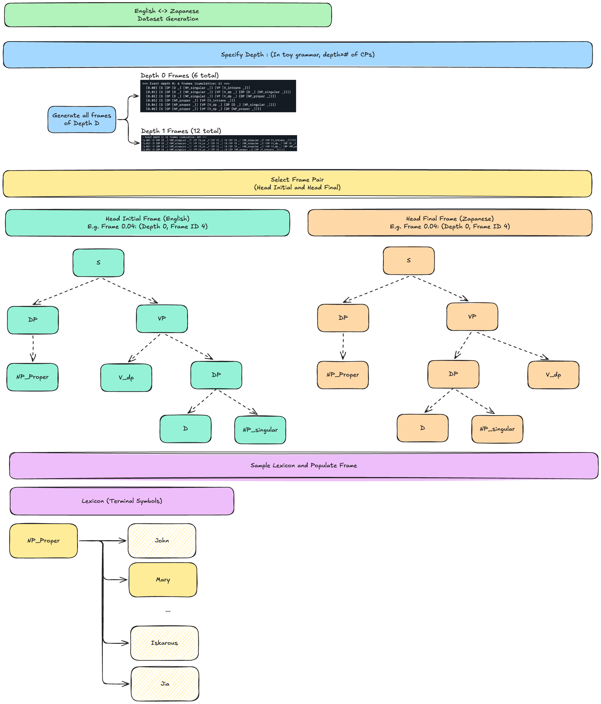

# {{ page.meta.date }} | Maxwell

**Goal:** {{ page.meta.goal }}

**Summary:** {{ page.meta.summary }}

**Work sessions**

| In   | Out  | Task |
|------|------|------|

| {{ s.in }} | {{ s.out }} | {{ s.task }} |


