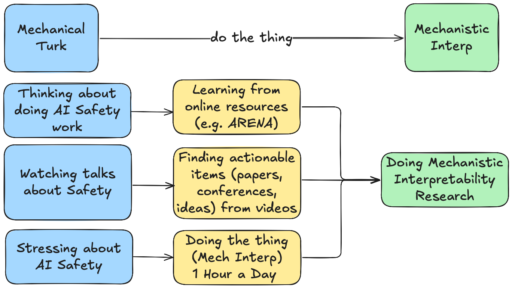

# Doing The Thing: From Mechanical Turk to Mech Interp
Visiting San Francisco for COLM 2026 Tuesday, October 6th - Sunday, October 11th. Would love to chat and meet folks!

???+ tip "Updates"
    0. Currently investigating how the QK and OV projections in the Attention Mechanism represent and process *syntax*,the structure of sentences, through the task of translation from "SVO" Head Inital (e.g. English) to "SOV" Head Final (e.g. Japanese) languages [[daily research journal](https://docs.google.com/document/d/1Q9-qicusAw7CJGslPEBcdXTpFy9Mz3l83YaJG5Diwp0/edit?tab=t.hj03mca737pr), advised by [Professor Khalil Iskarous](https://dornsife.usc.edu/profile/khalil-iskarous/) and [Professor Robin Jia](https://robinjia.github.io)]

    1. Previously working on extending and reproducing Anthropic's [MOLTs (sparse Mixtures of Linear Transforms)](./notes/projects/MOLTs.md) as part of [Georg Lange's SPAR stream](https://sparai.org/projects/sp26/recEvvXXZbGC8SHKC?search=Georg) on *Automating Circuit Interpretability with Agents* ([writeup](https://drive.google.com/file/d/1j29tCtfDae0smb8Rn-KbLZ0EN2QpV4o4/view?usp=sharing), [github](https://github.com/Ky-Ng/repro-molts))

    2. Reproducing [Transluce's Predictive Concept Decoders (PCD)](./notes/projects/pcd.md) to "read the mind" of an AI model through decoding activations of a Subject Model into natural language via a Sparse Encoder and LLM Decoder Model [[github](https://github.com/Ky-Ng/repro-pcd)]
    
        - Started Karpathy-inspired video tutorials PCD reproduction line-by-line to make AutoInterp research more accessible [[video walkthrough](https://www.youtube.com/playlist?list=PLd_GVe4IPmpAvb9zdWgl6QLMYOH-9TEkT)]

    3. Playing with Fire: Proposal for a Sharing AI Safety Research with At-Risk Youth through Games [[video](https://drive.google.com/file/d/11ux_p18Wr5mNtIz80o85EwfDVS9GV-GU/view?usp=sharing), [documentation](./notes/projects/PlayingWithFire.md)]
        - 3-step pipeline to making AIS research accessible to broader community (e.g. at-risk teenagers using AI for mental health counseling); “AIS researchers are only one piece of the puzzle” ethos 
    
    4. Reflections from first 3 weeks of 2026 abroad at [LISA](https://www.safeai.org.uk/) and attending Oxford AI Safety Initiative's [ARBOx](./notes/reflections/ARBOx.md) including work in progress [Theory of Change](./notes/reflections/TheoryChange.md)

??? note "TLDR of Things I've Done Since Starting My AI Safety Journey {{ dlog_num_days() }} Days Ago"
    **Projects**

    1. Cross-Linguistic Alignment: Does LoRA Fine Tuning a model on a task (e.g. respond in all CAPS) translate cross-linguistically? ([Summary](https://docs.google.com/presentation/d/16jQDJhF4orOrSzpVKMJwtU52u-vlzT77pCK8gZGwO9g/edit?usp=sharing) && [Github](https://github.com/leungchristopher/arbox_project))

    2. Reproducing [Neo et al. 2024 Interpreting Context Look Ups](./notes/papers/interpretability/Neo_et_al_2024.md)

    3. [Multilingual Semantics Probe](./notes/projects/MultilingualSemanticsProbe.md): Looking for Steering Vectors for semantically ambiguous sentences in English but not Mandarin 

    3. Syntactic Dependencies in Transformers: Attention Patterns for Balanced Parentheses (Dyck) Language ([Github](https://github.com/Ky-Ng/Dyck-Interp-Probe))

    **Programs**

    1. [ARBOx](./notes/reflections/ARBOx.md): 2 weeks of compressed ARENA curriculum; project on Cross-linguistic generalization of fine-tuning
    
    2. Attended NeurIPS [Mech Interp 2025 Workshop](https://mechinterpworkshop.com) and found some cool [takeaways](./notes/reflections/meetings/NeurIPS_2025_Mech_Interp_Workshop.md)!

    3. Started being mentored by [Sudhanshu Kasewa](https://www.linkedin.com/in/skasewa/?originalSubdomain=uk) from [80,000 Hours](https://80000hours.org/)

## What is this?
Here it goes! I'm Kyle, a 5th year undergrad/1st year master's in Computational Linguistics student at USC. I am very greatful to be jointly advised by [Professor Khalil Iskarous](https://dornsife.usc.edu/profile/khalil-iskarous/) and [Professor Robin Jia](https://robinjia.github.io). 

### Motivation
This is my daily log, **doing-the-thing**, a self-accountability + documentation + reflection in my journey in becoming a Mech Interp researcher.

If **Language connnects us**, how can studying *language* models at the intersection of linguistics and interpretability help us build *human understanding* of (a) **how LLMs work and when they fail** and (b) inform theories of **real-time language processing in humans**.

### Burning Questions
From a scientific angle, my current burning questions are:

1. What causal mechanisms allow language models to implement *symbolic* and *discrete* algorithms in *distributed* and *continuous* architectures? (e.g. syntax and translation)

2. How do these causal mechanisms emerge from training pressures, specifically the axes of training data and model architecture?

3. How can we create more *faithful* and *accessible* metaphors for general audiences to understand AI? (e.g. de-risk youth populations who confide in AI models for mental health counseling)

??? example "Extra Stuff (click me)" 

    ### Wait What's Computational Linguistics?

    As a Computational Linguistics student, I see Computational Linguistics as three parts:

    1. Linguistics = study of *human* language processing / cognition
    2. Mechanistic Interpretability = study of *LLM* language processing / cognition
    3. Computational Linguistics = Interdisciplinary approach to studying LLM language processing 

    The Computational Linguistics topics that pull me at 9.8 m / s^2 are concepts like Information Theory and Probabilistic Phonology in addition to frameworks like Causal Abstraction and RASP (Restricted Access Sequence Programming).

    ### What does Mechanistic Interpretability mean to me?
    - I hope that having deep knowledge in both the fields of linguistics and ML/NLP can help me build a more holistic understanding of LLM cognition and language processing. 
    - I see Mechanistic Interpretability as a sort of [psycholinguistics](https://www.britannica.com/science/psycholinguistics) (the study of real-time processing of language) for LLMs. 
    - Furthermore, I see Mechanistic Interpretability as a foundational basis for understanding AI systems. Perhaps understanding models (such as like biological organisms) can support AI Safety, linguistics research, and provide more nuanced understanding of language models to the general public

## Working Backwards :octicons-clock-16:
Sometimes (often) I get analysis paralysis or want to wait for the perfect {time, situation, background, preparation} to start which makes it difficult to get into pursuing my goals (and dreams). So this time around, I know my goal **to become a Mech Interp** researcher! After finding David Quarel's [do the thing](https://davidquarel.github.io/2024/02/04/Do-the-thing.html#fn:audience) I decided that this site is a place where I will keep myself acountable for *doing the thing*.

- Doing --> Working through math problems, reading papers, writing down lists of possible intersections of linguistics and NLP
- The Thing --> Any of the above for at least 1 hour every day, with consistent (though not perfect) progress. 

I had started doing the thing as a full-time student in my 4th year of undergrad. Mech Interp research is now my full-time priority (outside of TAing for a linguistics course) and far exceeds 1 hour a day

<!--  -->

## What is **dlog**? 
I am starting this daily log or *dlog* where every day I will document my progress. I hope that the daily act of documenting will make me more resilient and help prove to myself how badly I want to be an interpetability researcher. With the help of AI, a macro pulls the daily logs into the summary you see below:

## **dlog**: {{ dlog_num_days() }} Days and Counting
**Total time focused so far:** {{ dlog_total_time()["hrs"] }} hrs {{ dlog_total_time()["mins"] }} mins throughout {{ dlog_num_days() }} days of learning

Below are the latest updates (auto-generated). 

### Latest entries
{{ dlog_cards(limit=10) }}