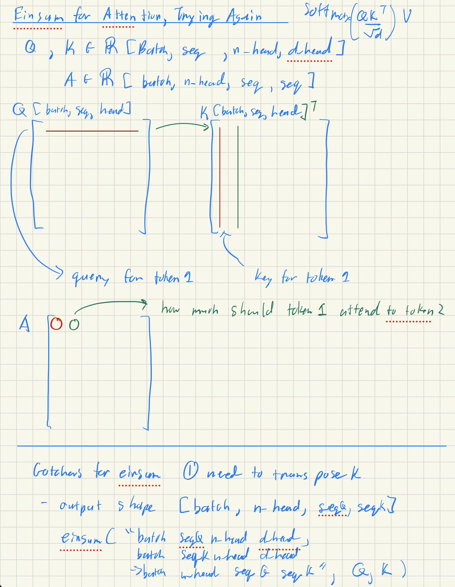
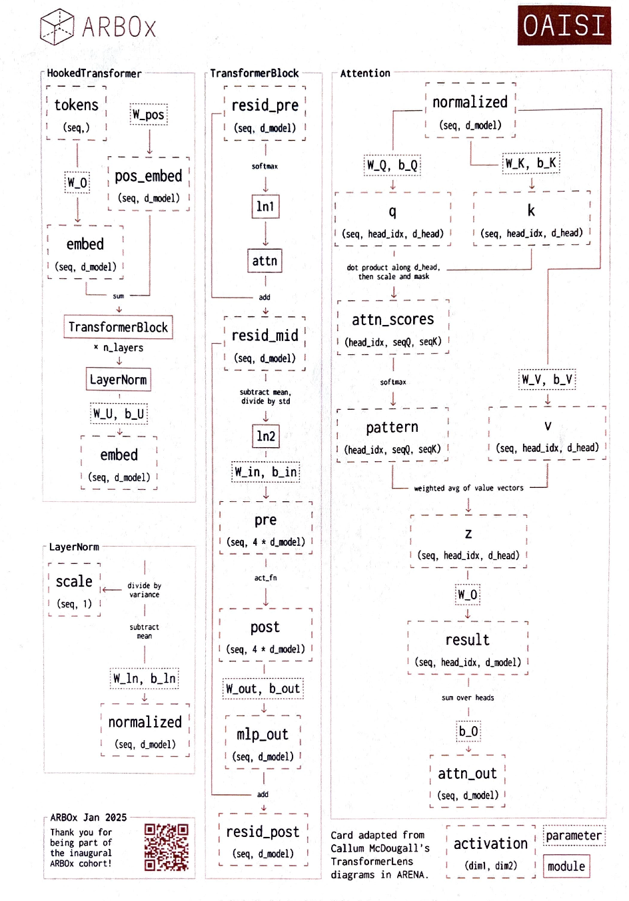

# Einsum Guide for Attention Pattern

## Motivation
- Einsums allows us to more explicitly label what types of computations occur between two tensors in (1) a compact command (2) with labelled shapes
	- Helpful for when there's lots of dimensions to handle
- Goal for this document is to go over a generalized formula for how einsums work

Note: I found [this youtube tutorial](https://www.youtube.com/watch?v=pkVwUVEHmfI) and [guide](https://rockt.ai/2018/04/30/einsum) very helpful especially with idioms 
for using einsums
- this document is to summarize the high level algorithm for converting einsums into loops, refer to the docs above for those helpful idioms
## Free vs. Sum Indexes
```python
einsm("ij, jk -> ik", A, B) # Matrix multiplication A @ B

# Free Indexes = {i, k}
# Summation Indexes = {j}
```

1. Free Indexes --> Index occurs in the output
2. Sum indexes (also called contraction dimensions) --> (~{Free Indexes}), everything that's not a free index

## Algorithm for Free vs. Sum Indexes
```python
# Example: einsm("ij, jk -> ik", A, B) # Matrix multiplication A @ B

# Step 1: Declare Indexes
free_indexes = {i,k}
summation_indexes = {j}

# for each index, imagine that the capital (e.g. I) is the size of the dimension

# Step 2: Setup output
ans = torch.zeros([I,K], dtype=torch.float32)
A = ... # Input Tensor 1
B = ... # Input Tensor 2

# Step 3: Free Indexes
for i in range(I): 
	for k in range(K):
		# Step 4: Setup an accumulator
		sum_ = 0 
		
		# Step 5: Summation Indexes
		for j in range(J):
			sum_ += A[i,j] * B[j,k]
	
	# Step 6: Writeout
	ans[i,k] = sum_
```

### Attention Pattern
$$
\text{attention\_pattern} = softmax\frac{QK^\top}{\sqrt d}V
$$



```python
einsum("batch seqQ n_head d_head, 
		batch seqK n_head d_head,
	->  batch n_head seqQ seqK,
		Q, K)

free_indexes = {batch, n_head, seqQ, seqK}
summation_indexes = {d_head}

attn = torch.zeros([batch, n_head, seqQ, seqK], dtype=torch.float32)

for batch in B:
	for n_head in N_HEAD:
		for i in seqQ:
			for j in seqK:
				sum_ = 0
				
				for c in D_HEAD:
					sum_ += Q[batch, i, n_head, c] * K[batch, j, n_head, c]
					# Notice how even thouh we didn't transpose, for each row of Q we go through a row of K which is the same thing as a transpose!
			attn[batch, n_head, i, j] = sum_
```

- Alternative to `einsum` if we were to use good ol' matrix multiplication requiring `permute` and `transpose` 
```python
Q = Q.reshape(batch, seq, self.num_heads, self.d_head)
K = K.reshape(batch, seq, self.num_heads, self.d_head)

# Permute
Q = Q.permute(0,2,1,3) # [batch, num_heads, seqQ, d_head]
K = K.permute(0,2,1,3) # [batch, num_heads, seqK, d_head]

# Transpose K as in the formula
K = K.transpose(-1,-2) # [batch, num_heads, d_head, seqK]

"""
# [batch, num_heads, d_head, seqQ]
						free		[ batch
						free		  num_heads
						sum		      d_head
						free		  seqK
									]
"""

Q @ K # [batch, num_heads, seqQ, seqK]
```

## Additional Resources
- Transformer lens diagram
