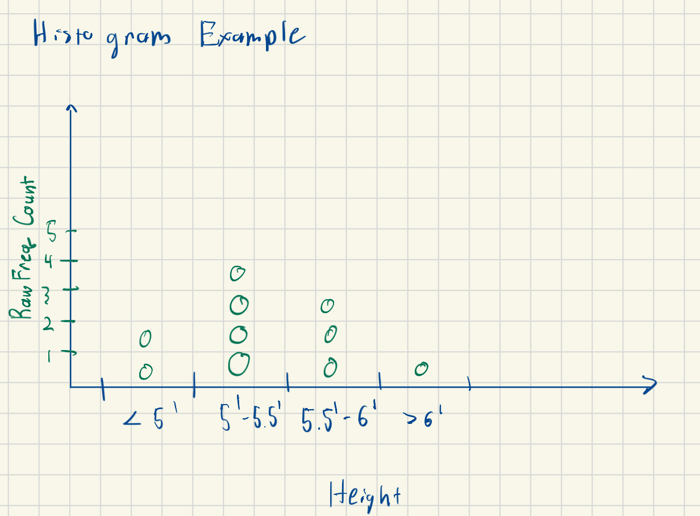

# Stats and Probability Concepts

## Distributions
??? abstract "Probability Distributions"
    ### Definitions
    - Histogram: Discrete plot where x-axis is buckets of a measurement (e.g. heights from 5' to 5.5') and y-axis is the count of the number of measurements (e.g. number of people between 5' to 5.5')
        - In some ways, this is like a C++ array where index is the quantity we want to measure and the value in that index is the frequency count
    
        - Here we see the discretized bins; we see the distribution show most height are around 5'-6'
        - We would say the probability distribution is centered around the 5'-6' bins and that seeing a 5'-5.5' person has the greatest probability
            - If we were to pick a person at random, there is the highest probability that that person is from bin 5'-5.5'
    
<!-- - Curve: 

Note: Histograms can approximate the curves/bins  -->

