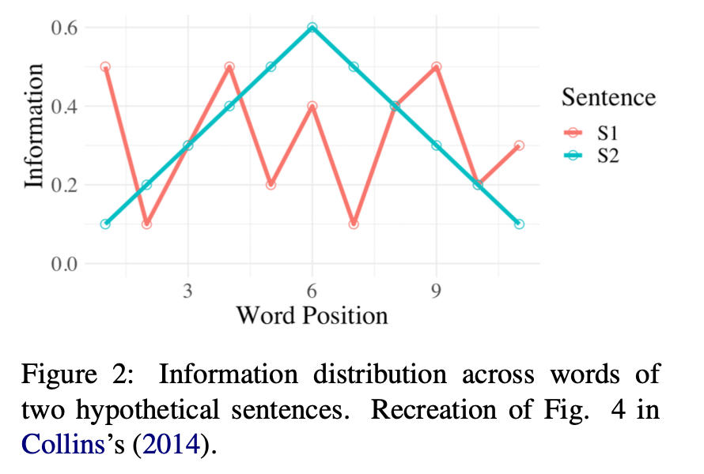

# Revisting the Uniform Information Density Hypothesis
Authors: Clara Meister, Tiago Pimentel, Patrick Haller, Lena Jäger, Ryan Cotterell, Roger Levy

Publication Date: 2021-09-23

Full Paper: [Revisiting the Uniform Information Density Hypothesis](https://arxiv.org/abs/2109.11635)

- See UID as a signal smoothing of effort or a regression to the mean of a targtet information rate
- Complicated by Global vs local UID (e.g. UID as minimizing word to word variability or total deviation from the mean)

## Surprisal
???+ info "Surprisal"
    - Given a signal $\textbf{u} = \lang u_1, u_2, ... u_N \rang$
    - "Surprisal is the negative log prob of the unit conditioned on its prior context"
    $$ \text{surprisal of unit n} = s(u_n) = - \log p(u_n | \textbf{u}_{<n}) $$

## Effort
???+ info "Effort"
    $$ \text{Effort} (u_n) \propto  s(u_n) $$

    - Problematic definition below shows that individual surprisal is not incentivized to distribute information in an utterance
    $$ \text{Effort} (\textbf{u}) \propto  \sum^N_{n=1} s(u_n) $$

    - This paper proposes a (1) super-linear (greater than linear) function of surprisal which is (2) linear to utterance length
    $$ \text{Effort} (\textbf{u}) \propto  \sum^N_{n=1} s(u_n)^k + c \cdot N$$

        where $ c > 0 $ and $ k > 1 $

## UID Scope (Global vs. Local)
1. S1 (Red) has better Global UID (relative to a specific mean information rate)
    - "as information content per word varies less—in absolute terms—across the sentence"
2. S2 (Blue) has better Local UID since there are no big jumps in information rate between consecutive words
    - "interpret UID as a pres- sure to avoid rapidly shifting from information dense (and therefore cognitively taxing) sections to sections requiring minimal processing effort"

???+ info "Global UID"
    - UID applied globally to a target mean information rate
        - Some researchers propose that a universal channel rate exists
    $$ UID^{-1} = \frac{1}{N} \sum^N_{n=2} \Delta (s(u_n), \mu _c)$$ 

???+ info "Local UID"
    $$ UID^{-1} = \frac{1}{N-1} \sum^N_{n=2} \Delta (s(u_n), s(u_{n-1}))$$ 
