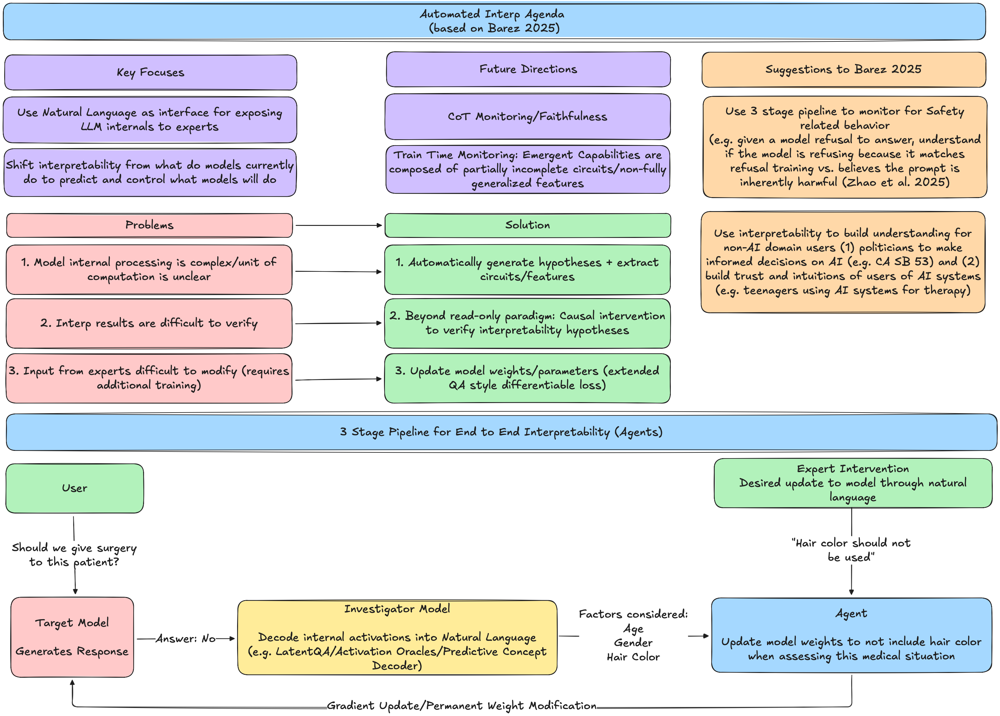

# Automated Interpretability Agenda

Flowchart and summarization of ideas + 2 suggestions of use cases for Fazl Barez's Automated Interpretability Agenda 2025

??? note "Thoughts on Why Automted Interpretability is Underrated"
    Automated Interpretability has strong promise to catalyze interpretability from a descriptive tool of current model behavior to a robust predictive pipeline to monitor, control, and permanently intervene on increasingly powerful models. The 3-step agentic system in Automated Interpretability-Driven Model Auditing and Control: A Research Agenda [Barez 2026] allows domain experts to interact with 

    (a) target frontier model, 

    (b) decode internal activations into natural language via an investigator model a la LatentQA [Pan et al. 2024], Activation Oracles (AO) [Karvonen et al. 2025], Predictive Concept Decoders (PDC) [Huang et al. 2025], and 

    (c) update model weights to reflect domain expert judgements and verify changes using causal intervention.

    I argue that Automated Interpretability agenda is underrated because in addition to pipelines that can monitor CoT faithfulness [Barez et al. 2025] and detect/control emerging model maligned behavior during training with scale (“bitter lesson” style), I also argue that this system can accelerate Safety research racing against soon-to-be agentic Capabilities research while building trust and intuition with non-technical audiences. For example AutoInterp can:

    (1) accelerate/verify existing interpretability research such as facilitating end-to-end agent driven causal intervention experiments; step (b) from above could detect whether a model’s harmfulness refusal is using the universal refusal direction [Wang et al. 2025] or an independent harmfulness steering vector [Zhao et al. 2025] 

    (2) increase literacy of policymakers on current AI Safety practices (e.g. policymakers can independently run causal intervention experiments through a natural language interface) to build intuition/informed decision on AI governance (e.g. California Senate Bill 53) [SB-53]

    (3) build trust and intuitions of general users of AI systems (e.g. teens using AI systems for therapy/education can verify underlying reasoning for model responses)

    Essentially, Automated Interpretability’s 3-step agentic pipelines have the potential to transform interpretability from a bespoke art, to a scalable science that mitigates x-risk by empowering human engagement and trust of safety in AI systems.

    References:
    
    [Automated Interpretability-Driven Model Auditing and Control: A Research Agenda [Barez 2026]](https://aigi.ox.ac.uk/publications/automated-interpretability-driven-model-auditing-and-control-a-research-agenda/)

    [LatentQA: Teaching LLMs to Decode Activations Into Natural Language [Pan et al. 2024]](https://arxiv.org/abs/2412.08686)

    [Activation Oracles: Training and Evaluating LLMs as General-Purpose Activation Explainers [Karvonen et al. 2025]](https://arxiv.org/abs/2512.15674)

    [Predictive Concept Decoders: Training Scalable End-to-End Interpretability Assistants [Huang et al. 2025]](https://arxiv.org/abs/2512.15712)

    [LLMs Encode Harmfulness and Refusal Separately [Zhao et al. 2025]](https://arxiv.org/abs/2507.11878v1)

    [Refusal Direction is Universal Across Safety-Aligned Languages [Wang et al. 2025]](https://arxiv.org/abs/2505.17306)

    [Chain-of-Thought Is Not Explainability [Barez et al. 2025]](https://aigi.ox.ac.uk/publications/chain-of-thought-is-not-explainability/)

    [California Senate Bill 53 [SB-53]](https://leginfo.legislature.ca.gov/faces/billTextClient.xhtml?bill_id=202520260SB53)