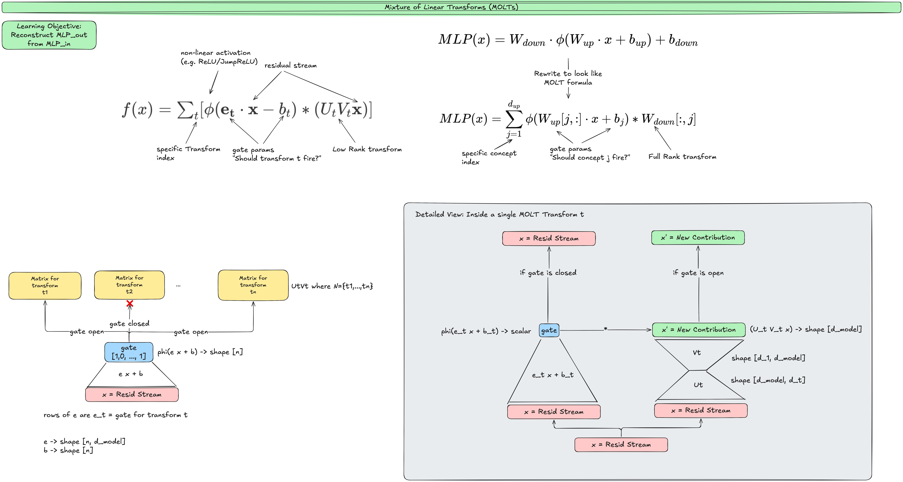

# Mixture of Linear Transforms (MOLTs)

Writeup: [Extending Sparse Mixture of Linear Transforms](https://drive.google.com/file/d/1j29tCtfDae0smb8Rn-KbLZ0EN2QpV4o4/view?usp=sharing)

Github: [github.com/Ky-Ng/repro-molts](https://github.com/Ky-Ng/repro-molts)

Anthropic Transformer Circuits Thread: [Sparse mixtures of linear transforms](https://transformer-circuits.pub/2025/bulk-update/index.html) (Introduced by Anthropic in July 2025 as an alternative to Transcoders)

