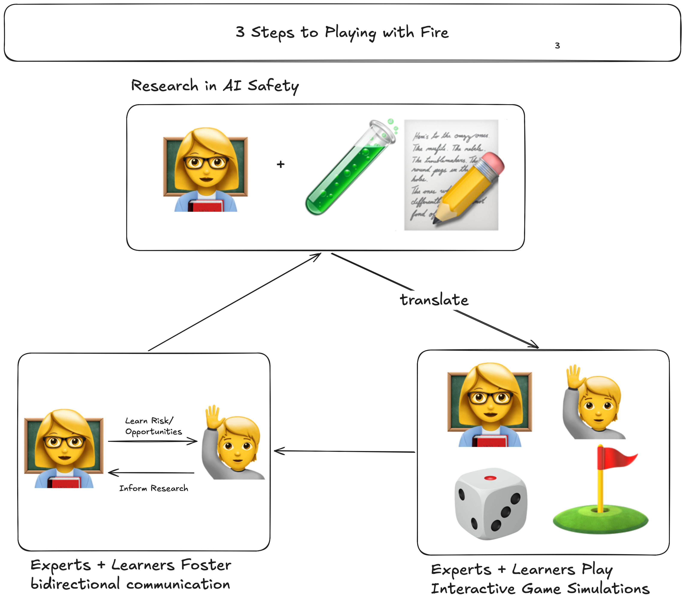

# Playing with Fire

Start Date: April 11th, 2026

[Video Proposal](https://drive.google.com/file/d/11ux_p18Wr5mNtIz80o85EwfDVS9GV-GU/view?usp=sharing) \[people are busy, this is meant to be a short pitch!]

[Accompanying Slide Deck](https://docs.google.com/presentation/d/1fgkpCI9w94ks74QqYkw-a5yhXyHmtgD_uCnExjQnLOo/edit?usp=sharing)

> "Nothing in life is to be feared, it is only to be understood" - Marie Curie

`Playing with Fire` is a proposal for a 3 stage pipeline to share AI Safety research with the local community--at risk teenagers--on the dangers of using AI for mental health counseling. How? Good question!

While AI Safety/Interp research is not very accessible, playing games, `playing with fire` through interactive games that share the key takeaways of interp literature can (1) share AIS research with the local community while (2) fostering communication between researchers and the people they work to protect.

Hopefully, `playing with fire` (not a presentation, scary RL formula, or lecture) will help general audiences understand the [light and shade](https://www.anthropic.com/company), taking away the benefits and risks through "playing" with intuitive game simulations of models.

- Inspired by Grant Sanderson (3 Blue 1 Brown) who talks about teaching math as a "smoking gun detective mystery"!