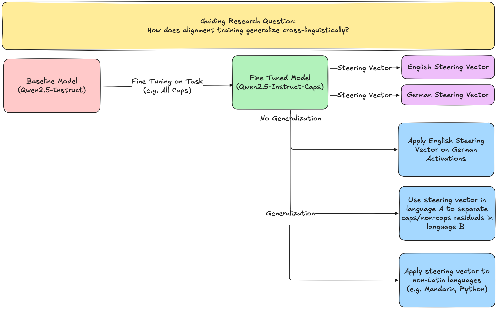

# ARBOx3
Date: 26.01.05 - 26.01.16

Location: Trajan House, Oxford

Organization: Oxford AI Safety Initiative (OAISI)

Time: 24 hours of non-stop AI Safety for 2 weeks straight

## Checking Back In!
Wow, what an amazing past 2 weeks this has been. I honestly don't even know where to start. In three lines (good ol' rule of 3), here's my big takeaways from working out of Trajan House (Effective Altruism co-working space) for ARBOx (Alignment Research Bootcamp Oxford) as part of OAISI (Oxford AI Safety Institute); quite a few acronyms but will make the latter text easier to read!

P.S. I am currently writing this on my way from Oxford to London on a comfortable GWR (Great Western Railway) line excited to work at LISA next week before returning back to California.

This is meant to be a recap of my experience, high-level takeaways, future directions, and just things I found interesting/don't want to forget.

## ARBOx Capstone Project
Cross-linguistic Alignment: Does LoRA Fine Tuning a model on a task (e.g. respond in all CAPS) translate cross-linguistically? If so, is the steering vector for that concept the same across languages? If not, can steering the model to think it's in the fine-tuned language increase performance?

1. [Summary](https://docs.google.com/presentation/d/16jQDJhF4orOrSzpVKMJwtU52u-vlzT77pCK8gZGwO9g/edit?usp=sharing)

2. [Github](https://github.com/leungchristopher/arbox_project)

## 3 Takeaways from 2 Weeks of Non-stop AI Safety

1. The community in AI Safety is very genuinely concerned with reducing x-risk (existential risk) of AI. Common discussions over (delicious vegan) lunch consist of 

    a. [Theory of Change](https://www.theoryofchange.org/what-is-theory-of-change/) (Connecting *what you do* to the *change you want to make* from a specific goal). People often `backchain` or work backwards from their specific goal to solve the `missing middle` action they should take. They then `red-team` or aggressively challenge their assumptions on the linke between action and goals!

    b. [Timelines](https://ai-2027.com/research/timelines-forecast) when ASI (Artificial Superintelligence) will be achieved and Handoffs which is how successful transitions/dynamics between AI and humans will occur.
    
    c. Subfield of Interest: This necessitates more than technical AI research but also folks working on Technical Governance/Policy, Grantmaking, Field-building, and more.

2. People are very friendly, open-minded, and willing to help each other in any way they can! The community feels very collaborative and encouraging. People are generally wicked smart.

3. Talking to people has helped me develop an initial Theory of Change and future project directions

## Next Steps

!!! note "Theory of Change (Work in Progress)"
    Goal: Mitigate x-risk by deeply understanding the internals/behaviors of LLMs
    
    Interests: Computational Linguistics Lens on Mechanistic Interpretability (MechInterp), Automated Interpretability (AutoInterp), and Cross-linguistic Generalization of Alignment/Fine Tuning

    Missing Middle:
    
    1. Technical research in MechInterp from topics like: 
        a. bottom-up `circuits`/`attribution graphs` to
        
        b. top-down `steering vectors`, `Sparse Auto Encoders (SAE)`, and `Transcoders`
    
    2. Automating this Interp research with Agents to keep up with the pace of capabilities research which may soon use AI Research Agents and enable scalabe oversight and control; Interp from a `bespoke art to a scalable science`

    3. Make research tools that enable researchers from other domains (e.g. non-Interp Technical AI Safety backgrounds, politcians, non-AI domain specialists) to interact with interp research
        a.  My current feeling on this is expanding [Neo et al. 2024](../papers/interpretability/Neo_et_al_2024.md) to be a live website like Neuronpedia and support any HuggingFace/SOTA model

### Things I feel really excited about

1. Cross-linguistic Alignment/Generalization: Is a model aligned in English necessarily aligned in Chinese?

2. MechInterp: Finding circuits, Steering Vectors, and Features that represent linguistic / Safety concepts

3. AutoInterp: Automatically Interp data (e.g. attribution graphs) and create human interactive interfaces

Side note on Linguistics: Use perspectives from linguistics to ask questions that have Safety relevant results

### Potential Future Projects
1. Scale [Neo et al. 2024](../papers/interpretability/Neo_et_al_2024.md) to be usable by anyone (especially non-technical AI folks); Given a HuggingFace model, run interpretability scripts in the backend, present results in interactive frontend.

2. Cross-linguistic Alignment Generalization: Build on ARBOx capstone project on cross-linguistic generalization of CAPS feature to find circuits/steering vectors for Safety related concept (e.g. sycophancy, hallucination, self-harm)

3. Multilingual Emergent Misalignment: See if emergent misalignment is cross-linguistic (e.g. Training to give bad medical advice in Bulgarian generalizes to bad medical advice and power-seeking in Mandarin)

4. Multilingual Reasoning: See if reasoning in a specific language changes the output behavior of a model (e.g. Sharks and Pirates [Cross-linguistic Quantifier Scope Ambiguity](../projects/MultilingualSemanticsProbe.md))

5. Syntactic Dependencies Probe: Understand complete circuits for how an LLM trained on a Dyck (Balanced Parentheses) language resolves syntactic dependencies

6. Contribute JAX support to TransformerLens 

## Subfields of Technical Research
Also, there's probably many more subfields that I missed! (Found a distinction between empirical/theoretical technical research too)

1. Mutli-agent Systems: cooperation of AI agents, game theory, dynamical systems; key idea is that x-risk can come from not a single powerful misaligned AI model, but the interaction of many intelligent systems that together "collude"/"cooperate". (Talk by [Lewis Hammond](https://lewishammond.com) and conversation with [Eric Drextler](https://aiprospects.substack.com))

2. AI Control: Say our model is misaligned, we still want to use it to advance progress in research. How can we perhaps use another weaker/aligned model to verify the misaligned model is not harming people.
- Analogy from Lord of the Rings: Gollum/Smeagle is misaligned but can provide lots of value to Frodo. We can still get the benefits of using the misaligned Gollum/Smeagle since we can trust Sam to control/watch over. 

3. Theory: Singular Learning Theory (this I will need some more quiet time to look into)

4. Evals: Conversation with [Lucas Sato](https://metr.org/team/lucas-sato/)

5. Computer Policy/Security: Lots of discussion on controlling access to chips and protecting model weights from being exfiltrated (the act of a model or bad actor from "stealing" model weights). (Talk from [Nick Marsh](https://marsh.blue))

7. Lots of Computer Science and Philosophy / Law people: I don't understand [Bayesian Epistemology](https://en.wikipedia.org/wiki/Bayesian_epistemology) but hope to understand more in the future!